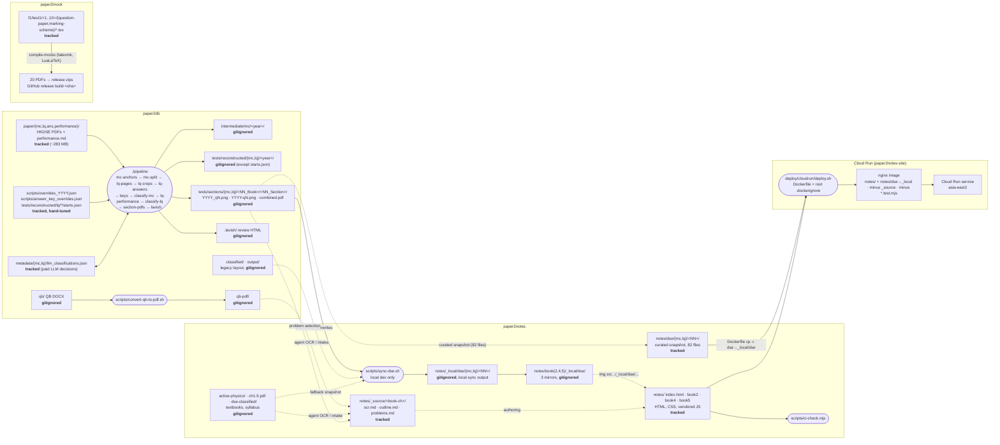

# [paper2everything] Architecture

This document maps the monorepo as the code implements it: its components, the
build and sync scripts, what is tracked or generated, every data flow, and which
way each subproject depends on the others. It closes with the design smells found
while mapping (section [Design findings](#design-findings)). It records them; it
does not fix them.

A visual version of the same map is in the Lavish board at
`.lavish/architecture-board/index.html` (open it with
`lavish-axi .lavish/architecture-board/index.html`).

## One-paragraph summary

Three subprojects share one git repository but only one code-level dependency
connects them: **paper2notes reads paper2db's generated DSE crops**. In local
development the read is `paper2notes/scripts/sync-dse.sh` into gitignored
`_local/` folders; in production it is a curated snapshot at
`paper2notes/notes/dse/` (82 files, `mc`/`lq`) staged into the image by the
`Dockerfile` (since 361de93). **paper2mock is fully independent**. The graph
has no cycle. The remaining weak point is that single edge: it is still an
undeclared filesystem-layout contract that CI never checks, even though the
image now carries crops.

## Components

| Component | Language / runtime | Entry point | Output |
|---|---|---|---|
| `paper2db/` | Python 3 (PyMuPDF, Pillow, OCR, optional LLM API) | `./paper2db/pipeline` (11 stages, `--list-stages`) | MC/LQ crops per year and per syllabus section, section PDFs, answer keys, audit JSON, review HTML |
| `paper2db/scripts/convert-qb-to-pdf.sh` | Bash + LibreOffice | run by hand | `paper2db/qb-pdf/` PDFs from `paper2db/qb/` DOCX |
| `paper2notes/notes/` | Static HTML/CSS/JS (vendored three.js, KaTeX) | open in a browser; no build | the student site (landing `/`, `/book2/`, `/book4/`, `/book5/`) |
| `paper2notes/notes/dse/` | Static file tree (PNG + PDF) | committed snapshot (since 361de93) | `paper2notes/notes/dse/{mc,lq}/<NN>/` (82 files) staged to `_local/dse/` by `Dockerfile` |
| `paper2notes/scripts/sync-dse.sh` | Bash (+ inline Python for placeholders) | run by hand from the repo root | `paper2notes/notes/_local/dse/` and `paper2notes/notes/book{2,4,5}/_local/dse/` (local dev) |
| `paper2notes/scripts/ci-check.mjs` | Node | `ci-notes` workflow | pass/fail (structure and relative links) |
| `paper2notes/deploy/cloudrun/` | Docker, nginx, gcloud | `deploy.sh` (build, push, roll out), `provision.sh` (one-time GCP setup) | Cloud Run service `paper2notes` in `asia-east2` |
| `paper2mock/f1/test1/<1..10>/{question-paper,marking-scheme}/` | LuaLaTeX via latexmk | `compile-mocks` workflow | 20 PDFs, released as two zips per push to `main` |

## Data-dependency diagram

Solid arrows are automated steps (a script or workflow moves the data). Dashed
arrows are manual or agent-driven steps (a person or agent reads one artifact and
writes another). Boxes marked **tracked** are in git; **gitignored** boxes exist
only on a machine that generated them.

### Dependency directions between subprojects

| From → To | Kind | Where |
|---|---|---|
| paper2notes → paper2db | **Build-time data** (filesystem read of generated crops) | `paper2notes/scripts/sync-dse.sh` (`P2DB="$ROOT/../paper2db"`) |
| paper2notes → paper2db | Authoring provenance (docs only, agent-driven) | `paper2notes/notes/_source/*/problems.md` cite `paper2db/qb-pdf/` and `paper2db/classified/mc/` |
| paper2db → paper2notes | None in code; one comment | `paper2db/scripts/convert-qb-to-pdf.sh` header mentions the paper2notes intake contract |
| paper2mock ↔ anything | None | `paper2mock/` reads and writes only its own tree |
| Cloud Run → paper2notes | Deploy input | `paper2notes/deploy/cloudrun/Dockerfile` copies `paper2notes/notes/` |

There is no dependency cycle. paper2db does not know paper2notes exists.

## Tracked versus generated data

| Path | Status | Why it matters |
|---|---|---|
| `paper2db/paper/**` (77 PDFs + performance notes) | tracked | Pipeline source. Plain git, no LFS; the pack is about 282 MB. |
| `paper2db/metadata/{mc,lq}/llm_classifications.json` | tracked | Paid, nondeterministic LLM decisions. Deliberately tracked. |
| `paper2db/scripts/overrides_*.json`, `answer_key_overrides.json` | tracked | Hand-tuned inputs. |
| `paper2db/tests/reconstructed/lq/*/starts.json` | tracked | Hand-tuned input stored inside a generated output tree. |
| `paper2db/intermediate/`, `tests/reconstructed/**` (rest), `tests/sections/`, `.lavish/` | gitignored | Pipeline output. `tests/sections/` is the product paper2notes consumes. |
| `paper2db/classified/`, `paper2db/output/` | gitignored | Pre-move legacy layout. `sync-dse.sh` still reads it. |
| `paper2db/qb/`, `paper2db/qb-pdf/` | gitignored | The documented "canonical" QB DOCX source is not in git. |
| `paper2notes/notes/**` (HTML, CSS, JS, vendored libs) | tracked | The site. |
| `paper2notes/notes/dse/**` (82 files, `mc`/`lq`) | tracked | Curated DSE publication snapshot; staged to `_local/dse/` in `Dockerfile` (since 361de93). |
| `paper2notes/notes/_source/**` (~24 MB) | tracked | OCR intake for authoring. Excluded from the image. |
| `paper2notes/notes/_local/`, `notes/**/_local/` | gitignored | Local sync output; in the image populated at build time from `notes/dse/` via `RUN cp -r`. `**/_local/` still excluded from context. |
| `paper2notes/.lavish/**` (~3.8 MB PNG + HTML), `b2_home.png`, `hello_test.png` | tracked | Review evidence and stray screenshots, checked in. |
| `paper2notes/active-physics/`, `ch1-5.pdf`, `dse-classified/`, `QB_50x/` | gitignored | Local textbooks and banks. |
| `paper2mock/**/*.tex` | tracked | PDFs are never committed; CI builds them. |

## Flows in detail

### 1. DSE banks: paper2db pipeline

`./paper2db/pipeline` reads `paper/{mc,lq,ans}/*.pdf` and
`paper/performance/*.md`, plus the tracked hand-tuned inputs, and runs the
stages listed in the diagram. Classification (`classify-mc`, `classify-lq`)
either reuses the tracked `metadata/*/llm_classifications.json` or calls the LLM
backend and rewrites it. `section-pdfs` writes
`tests/sections/{mc,lq}/<NN_Book>/<NN_Section>/` with PNG crops named
`YYYY_qN.png` (MC) or `YYYY-qN.png` / `YYYY-qN-ans.png` (LQ) and a
`combined.pdf`. The section taxonomy is the `SECTIONS` list in
`paper2db/scripts/classify_mc_llm.py` (imported by the LQ classifiers) and a
second copy in `paper2db/scripts/classify_mc_sections.py`.

### 2. DSE crops: paper2db → paper2notes (published snapshot + local sync)

Published snapshot (deployed): `paper2notes/notes/dse/{mc,lq}/<NN>/` is a
curated, tracked set of the 82 files HTML references (66 PNG crops + 16
`combined.pdf`). It is copied from the paper2db output (`tests/sections/`,
921 PNGs) and, on the 13 `QB`/custom paths not in paper2db, filled with
text placeholders (`sample.png`, `chain.png` etc). `paper2notes/deploy/cloudrun/Dockerfile`
stages it into the image at build time (`cp -r dse/* → _local/dse/` and
`book*/_local/dse/`) so production serves `_local/dse/…` without running the
pipeline.

Local preview (`sync-dse.sh`, developer machine): `paper2notes/scripts/sync-dse.sh`:

1. Resolves paper2db as `paper2notes/../paper2db`.
2. For each source that exists, in order `tests/sections/{mc,lq}`, then legacy
   `classified/{mc,lq}`, then (only if neither exists)
   `paper2notes/dse-classified/`, finds every PNG, derives a section number from
   the nearest folder named `^[0-9]{1,2}_`, and copies it flat into
   `notes/_local/dse/{mc,lq}/<NN>/`. PDFs, JSON and CSV follow the same rule.
3. If no PNG was found, writes six 1×1 placeholder PNGs for Book 5 through
   inline Python that uses CWD-relative paths.
4. Creates 0-byte `combined.pdf` files for sections 20–27 where none exist.
5. Mirrors the whole `notes/_local/dse/` into each of `notes/book2/`,
   `notes/book4/` and `notes/book5/` `_local/dse/` with `rsync -a` (no
   `--delete`).

Pages then load crops by relative path: section pages at
`notes/bookX/chYY/NN-N.html` use `../_local/dse/{mc,lq}/<NN>/<file>`, and book
indexes use `_local/dse/...`. Both resolve to `notes/bookX/_local/dse/`. No page
references `notes/_local/dse/` directly. 82 distinct `_local` references (66 PNG crops + 16 `combined.pdf` exports) are referenced
(Book 2: 8 = 0 PNG + 8 PDFs, Book 4: 20 = 15 PNG + 5 PDFs, Book 5: 54 = 51 PNG + 3 PDFs).

### 3. QB banks: DOCX → PDF → notes intake

`paper2db/scripts/convert-qb-to-pdf.sh` converts `paper2db/qb/**/*.docx` into
`paper2db/qb-pdf/` with LibreOffice (or, without LibreOffice, copies any PDFs
already in `qb/`). It is not a pipeline stage and nothing in paper2db reads its
output. The only consumer is the manual/agent intake that writes
`paper2notes/notes/_source/<book-ch>/{ocr,problems}.md`. The script header
promises a Tesseract OCR step that the script does not run.

### 4. paper2mock compile

`.github/workflows/compile-mocks.yml` builds all 20
`paper2mock/f1/test1/<n>/{question-paper,marking-scheme}/main.tex` with
LuaLaTeX, uploads each PDF as an artifact, and on push to `main` publishes
`question-papers.zip` and `marking-schemes.zip` to release `build-<sha>`. It has
no path filter.

### 5. CI

| Workflow | Trigger | Does |
|---|---|---|
| `.github/workflows/ci-notes.yml` | PR / push to main touching `paper2notes/notes/**`, `paper2notes/scripts/**`, `paper2notes/.github/workflows/**`, itself | `node paper2notes/scripts/ci-check.mjs`: book2/4/5 structure, relative `href`/`src` resolution (links through `_local/` skipped), and lavish notes-refactor boards (before/after side-by-side at 1280 + 390 and readable-measure contract — see `paper2notes/.agents/skills/lavish-notes-review/SKILL.md` and `docs/lavish-notes-boards.md`) |
| `.github/workflows/compile-mocks.yml` | every PR, every push to main | LaTeX build + release (above) |
| `.github/workflows/deploy-notes.yml` | push to main touching notes / deploy / `.dockerignore` | `google-github-actions/auth` via WIF (`GCP_WORKLOAD_IDENTITY_PROVIDER` / `GCP_DEPLOYER_SERVICE_ACCOUNT`) then `paper2notes/deploy/cloudrun/deploy.sh` → `asia-east2/paper2notes` (`paper2notes-site`) |

Not run in CI: the paper2db pipeline or its `unittest` suite, the Book 5
Puppeteer interactive tests (`notes.interactives.test.mjs`, hardcoded macOS
Chrome path), and `sync-dse.sh`. The nested
`paper2notes/.github/workflows/{ci,deploy}.yml` and
`paper2mock/.github/workflows/compile-mocks.yml` are copies GitHub never runs.

### 6. Cloud Run deploy

`paper2notes/deploy/cloudrun/deploy.sh` builds
`paper2notes/deploy/cloudrun/Dockerfile` with the repo root as context (it
detects the monorepo by looking for `paper2notes/notes/book5` at the git top
level), pushes to Artifact Registry
`asia-east2-docker.pkg.dev/paper2notes-site/paper2notes/site`, runs
`gcloud run deploy`, and curls `/`, `/book2/`, `/book4/`, `/book5/`. The root
`.dockerignore` admits `paper2notes/notes/` (including `notes/dse/`) and
`nginx.conf`, minus `_source/`, `**/_local/` and `*.test.mjs`. The
`Dockerfile` copies `notes/` to `/usr/share/nginx/html/` and then `RUN cp -r
dse/* → _local/dse/` (and into each `book*/_local/dse/`) as `root` and `chown`s
to `nginx`, so the shipped image serves the 82 `_local/dse/…` references from the
tracked snapshot without needing `_local` in context. nginx serves the notes as static
files on port 8080 with `absolute_redirect off`. `provision.sh` creates the GCP
project, registry, runtime and deployer service accounts, the Cloud Run service
and a Workload Identity Federation provider scoped to one GitHub repository.

## Design findings

Severity reflects impact on the monorepo's purpose (a working notes site backed
by paper2db banks), not effort. "Verified" means checked against the code or a
read-only probe on 2026-09-27; everything else is labelled as inference.

### High

**A3. The notes ↔ db interface is an undeclared filesystem layout.**
`sync-dse.sh` walks paper2db's internal output tree
(`tests/sections/{mc,lq}/<NN_Book>/<NN_Section>/`) through a hardcoded
`$ROOT/../paper2db`, and derives section numbers by regex on folder names. Book
folders (`05_Radioactivity_and_Nuclear_Energy`) match the same `^NN_` pattern as
sections (`05_Motion`), so a file sitting at book level would be filed under
the wrong section. Notes HTML hardcodes 82 `_local` references — 66 PNG crops in two naming schemes
(`YYYY_qN.png` for MC, `YYYY-qN.png` for LQ) plus 16 `combined.pdf` exports. There is no manifest or export
stage that paper2db owns.

**A4. Nothing checks that contract.** `ci-check.mjs` skips every link that
passes through `_local/` (`isKnownLocalOnly`), and no workflow runs paper2db. If
reclassification moves a question to another section, or paper2db renames a
folder, notes decks break silently. The crop choice lives in HTML, not in
paper2db's classification (for example `book5/ch01-.../25-1.html` shows LQ crops
from section 26).

### Medium

**A5. Several competing sources of truth feed one sync.** `sync-dse.sh` reads
`tests/sections/`, then legacy `classified/` (which, when present, overwrites
fresh crops, because `cp -n ... || cp ...` falls through to a plain `cp` when
the target exists; verified on macOS `/bin/cp`), then a local
`paper2notes/dse-classified/` snapshot. Root-level JSON/CSV use
`cp -n ... || true`, so an updated `answer_keys.json` never replaces an old one.
`rsync -a` without `--delete` never prunes crops that paper2db dropped.
Placeholders (1×1 PNGs, 0-byte `combined.pdf` for sections 20–27) look like
real data, and the Python placeholder writer uses CWD-relative paths, so running
the script from anywhere but the repo root writes them to the wrong place.

**A6. Four copies of every crop.** The sync writes `notes/_local/dse/`, which no
page references, and mirrors all of it into each book's `_local/dse/`, so Book 2
holds Book 5's crops and so on.

**A7. The syllabus-section taxonomy has no single owner.** `SECTIONS` is defined
twice in paper2db (`classify_mc_llm.py`, `classify_mc_sections.py`). The notes
repeat section numbers in 82 `_local` references (66 PNG + 16 PDFs), `sync-dse.sh` hardcodes placeholder sections
20–27, and the landing page hardcodes "paper2db §25–27".

**A8. QB banks sit in paper2db but belong to nobody.** The "canonical"
`paper2db/qb/` and its output `qb-pdf/` are gitignored, so the canonical source
is not versioned. The converter is outside `./pipeline`; its only consumer is
paper2notes intake. `_source/*/problems.md` cite `paper2db/classified/mc/...`
(48 references), a legacy layout the current pipeline no longer writes.

**A9. Product output lives under `tests/`, and tracked inputs live inside
generated trees.** `tests/sections/` is the bank that notes consume, and
hand-tuned `tests/reconstructed/lq/*/starts.json` is tracked inside an
otherwise-generated directory, held in place by chains of `!` negations in two
`.gitignore` files.

### Low

**A1. Production now serves crops via a published snapshot (resolved at 361de93).**
Previously pages referencing `../_local/dse/...` had no production path because
`_local/` is gitignored and `**/_local/` is excluded from context (verified
404 for `/book5/_local/dse/mc/25/2022_q31.png` while the page returned 200).
At `361de93` a curated snapshot at `paper2notes/notes/dse/` (82 files: 66 PNG
+ 16 `combined.pdf` for §05–12, 20–27) is committed and `Dockerfile` stages it
into `_local/dse/` at build time (`USER root` → `cp -r` → `chown nginx`),
so the image now serves DSE decks and “Export Ch.N PDF” links. The decision
to publish was the open question; the remaining gap is the unchecked
contract (A3/A4): the snapshot must be kept in sync with HTML references
manually.

**A2. The monorepo now deploys the site (resolved at cutover 47b7788).** Since `47b7788` `deploy-notes.yml` authenticates via Workload Identity Federation (`google-github-actions/auth` with `GCP_WORKLOAD_IDENTITY_PROVIDER` and `GCP_DEPLOYER_SERVICE_ACCOUNT`) and runs `paper2notes/deploy/cloudrun/deploy.sh` to the same Cloud Run service `asia-east2/paper2notes` (`paper2notes-site`), keeping the public URL `https://paper2notes-152505675251.asia-east2.run.app/`. The previous probe evidence (empty `gh secret list`, live `302`/`404` pre-monorepo build) is outdated. `provision.sh` still documents the WIF provider scope.

**A10. Inconsistent policy on checked-in generated artifacts.**
`paper2notes/.lavish/` (review HTML and ~3.8 MB of screenshots), `b2_home.png`
and `hello_test.png` are tracked, while `paper2db/.lavish/` is ignored. The
~283 MB of source PDFs are in plain git, not LFS.

**A11. Vendored code is copied per chapter.** `three.min.js` has 21 identical
copies (13 MB), `checks.js` 11, `notes.js` 11, and KaTeX 3. Figure renderers
are shared within Books 2 and 4, while Book 5 retains one per chapter. The
landing page and `book2/index.html` load `book5/css/notes.css`, coupling other
books to Book 5's stylesheet.

**A12. Dead or duplicated config left from the merge.** Nested
`.github/workflows/` in paper2notes and paper2mock never run, yet `ci-notes.yml`
still path-filters on `paper2notes/.github/workflows/**`.
`paper2notes/.dockerignore` is unused (the root one applies).
`paper2db/.no-mistakes.yaml` is nested with no root equivalent. Three
`.gitignore` files overlap. The Dockerfile and `deploy.sh` still describe a
standalone `paper2notes/` build, but the Dockerfile's root-relative `COPY` paths
make that path fail.

**A13. CI scope does not match the monorepo.** `compile-mocks` runs 20 LaTeX
jobs (and a release on `main`) for every change, including notes-only ones.
paper2db has a test suite no workflow runs.

**A14. Developer docs leak into the student site, and docs drift.** The public
landing page `paper2notes/notes/index.html` explains the paper2db pipeline and
gitignored paths, against `paper2notes/AGENTS.md`'s rule that student pages do
not show provenance. `paper2notes/README.md` now points to `../docs/ARCHITECTURE.md` §5/6 and `deploy-notes.yml` at the repo root (previously `deploy.yml`/`ci.yml`); the QB tables there still list `QB_50x/` inside paper2notes while the canonical QB is `paper2db/qb/`.

### What is sound

- The dependency graph is acyclic and one-directional; paper2db has no
  knowledge of paper2notes, and paper2mock is isolated.
- DSE crops now ship to production via the committed `notes/dse/` snapshot
  staged into the image, so decks render without a local `sync-dse.sh`.
- Paid LLM classification results are tracked as inputs, so rebuilding does not
  re-bill or re-randomise classification.
- The Cloud Run design (runtime SA with no roles, deployer limited to
  `run.developer` + registry writer, keyless WIF) is least-privilege.
- Generated PDFs from paper2mock are never committed; CI builds and releases
  them.

## Recommendations (not implemented here)

1. DSE crops now ship via the committed `paper2notes/notes/dse/` snapshot
   staged in `Dockerfile` (A1 resolved at 361de93). Follow-up is to keep the
   snapshot in sync with HTML references and paper2db reclassifications (see
   recommendation 2).
2. Give paper2db an explicit export: an `export` stage writing a flat
   `dist/dse/{mc,lq}/<NN>/` plus a manifest (section, year, question, file), and
   have notes reference manifest keys. Replace `sync-dse.sh`'s multi-source
   search with that one input, and add a CI check that every notes reference
   exists in the manifest (A3–A6).
3. Move the `SECTIONS` taxonomy to one module (or JSON) that both paper2db
   and the notes check read (A7).
4. Monorepo deploy now live at cutover `47b7788` via WIF to `asia-east2/paper2notes`; retire the standalone `paper2notes` deploy when ready (A2 resolved).
5. Delete the nested workflows and `.dockerignore`, add path filters to
   `compile-mocks`, and add a paper2db `unittest` workflow (A12, A13).
6. Decide QB ownership: either version the DOCX (LFS) with the converter as a
   pipeline stage, or move QB handling to paper2notes intake (A8).
7. Share vendored libraries at `notes/vendor/` and one notes stylesheet across
   books (A11).
